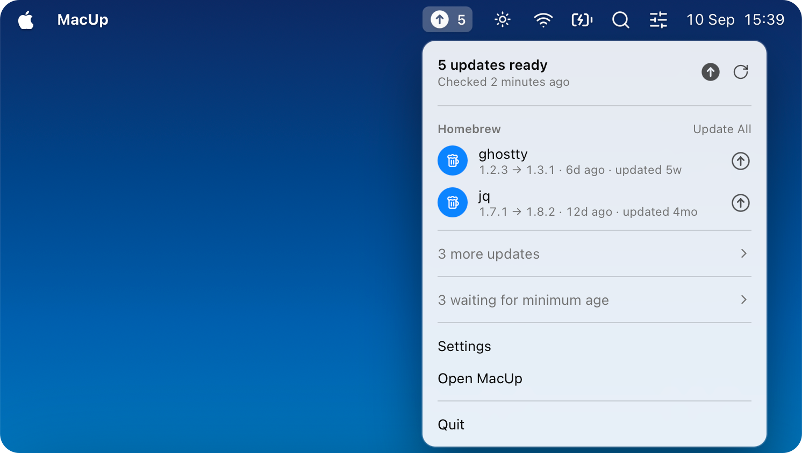

<p align="center">
  
</p>

<h1 align="center">MacUp</h1>

<p align="center">Keep your command-line tools up to date, from the menu bar.</p>

<p align="center"><a href="https://github.com/patriciobcs/macup/actions/workflows/ci.yml"></a> <a href="https://codecov.io/gh/patriciobcs/macup"></a></p>

MacUp is a macOS menu bar app for developers. It finds the package managers on your Mac, shows what is outdated with the release date and any known vulnerability, and updates it in one click using each manager's own commands. It needs no configuration to be useful.

Free and open source under the MIT license. Requires macOS 14 or later, Apple Silicon or Intel.

## Install

```sh
brew install --cask patriciobcs/tap/macup
```

Or download `MacUp.dmg` from the [latest release](https://github.com/patriciobcs/macup/releases/latest), open it and drag MacUp to Applications. Every release is signed with an Apple Developer ID and notarized.

MacUp keeps itself current the way it was installed. A Homebrew install lists its own cask among the updates and relaunches after upgrading. A downloaded copy updates through [Sparkle](https://sparkle-project.org). Each copy uses exactly one of the two.

## What it does

- **Discovers package managers.** Nineteen are supported (see the table below). Managers that are not installed stay out of the way.
- **Waits for releases to settle.** An update is shown once the release is at least a day old, a security fix after four hours. Both thresholds are adjustable. Waiting gives maintainers time to pull a broken or compromised release before it reaches you.
- **Shows the facts.** When the release was published, when your copy was installed, and whether the installed version has an advisory in [OSV.dev](https://osv.dev).
- **Runs the real commands.** Updates and removals use the manager's own tooling. Output streams into a log, and every action is recorded in a history.
- **Respects the system.** Packages owned by macOS itself, such as the system Ruby's gems, are hidden by default. Anything that needs an administrator password asks through the standard macOS prompt, never a stored credential.
- **Errors you can act on.** A failed manager shows one plain sentence with Retry, Copy Details and Report on GitHub. Being offline is one notice, not a list of errors.

## Supported package managers

| Manager | Detects outdated | Update | Remove | Release date | Advisories |
|---|---|---|---|---|---|
| Homebrew (formulae and casks) | `brew outdated` | yes | yes | Homebrew bump commit | no |
| npm, Bun, pnpm (global) | native | yes | yes | npm registry | OSV (npm) |
| pip, pipx, uv tools | native / PyPI | yes | yes | PyPI | OSV (PyPI) |
| Conda (base environment) | solver dry run | yes | no | no | no |
| rustup toolchains | `rustup check` | yes | no | rustup output | no |
| Cargo (installed crates) | crates.io | yes | yes | crates.io | OSV (crates.io) |
| Go binaries | Go module proxy | yes | yes | Go module proxy | OSV (Go) |
| RubyGems | `gem outdated` | yes | yes | RubyGems | OSV (RubyGems) |
| Composer (global) | native | yes | yes | Packagist | OSV (Packagist) |
| Nix (`nix-env`) | dry-run upgrade | yes | yes | no | no |
| mise | `mise outdated` | yes | no | no | no |
| MacPorts | `port outdated` | yes, admin | yes, admin | no | no |
| Mac App Store (via `mas`) | `mas outdated` | yes | no | no | no |
| macOS updates | `softwareupdate` | opens System Settings | no | no | no |
| Self-installed tools (uv, Bun, Deno, pnpm, mise) | GitHub releases | self-update | no | GitHub | no |

## Privacy

MacUp has no accounts and no telemetry. To do its job it does send some of your data to third parties: for each package that is outdated, its name goes to the relevant registry (npm, PyPI, crates.io, RubyGems, Packagist, the Go module proxy, or GitHub for Homebrew) to look up the release date, and its name and installed version go to OSV.dev to check for advisories. Nothing about packages that are up to date leaves your Mac, and nothing identifies you beyond your IP address. A downloaded copy also fetches the Sparkle appcast from this repository's releases. Package managers themselves contact their own registries as they normally would. All state lives in `~/Library/Application Support/Macup`.

## Limitations

- **Release dates for Homebrew** come from GitHub's API, limited to 60 anonymous requests per hour. Results are cached per version, so a fresh install with many outdated formulae shows "first seen" for some of them until the cache fills over a few scans.
- **Advisories** cover the ecosystems OSV.dev indexes. Homebrew formulae, Conda, Nix, mise and macOS updates are not checked.
- **The release-age wait is a heuristic**, not a guarantee. It reduces exposure to releases that are pulled quickly; it does not detect a compromised release on its own.
- **Nix** support covers `nix-env`. `nix profile` has no outdated listing.
- **Self-update of tools** applies only to copies installed by their own installers. Copies from Homebrew or npm are updated by those managers. When a tool's own updater fails, MacUp runs the vendor's documented installer script over HTTPS.
- **pip on Homebrew's Python** refuses changes under PEP 668; MacUp retries with `--break-system-packages` and shows that in the log.
- **Update All skips macOS updates** on purpose, since they need a restart. The row opens System Settings instead.
- **MacUp is not sandboxed** and is distributed outside the Mac App Store, because the App Store sandbox does not allow an app to run Homebrew or npm on your behalf. See [SECURITY.md](SECURITY.md).

## Contributing

Issues and pull requests are welcome. [CONTRIBUTING.md](CONTRIBUTING.md) covers building the app, the checks and tests, and how to add a package manager. For security matters see [SECURITY.md](SECURITY.md).

## License

[MIT](LICENSE). Bundled third-party software is listed in [THIRD_PARTY.md](THIRD_PARTY.md).
