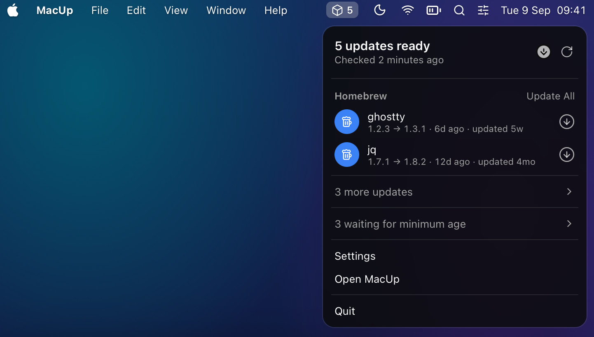

<p align="center">
  
</p>

<h1 align="center">MacUp</h1>

<p align="center">Keep your command-line tools up to date, from the menu bar.</p>

MacUp is a macOS menu bar app for developers. It finds the package managers on your Mac, shows what is outdated with the release date and any known vulnerability, and updates it in one click using each manager's own commands. It needs no configuration to be useful.

Free and open source under the MIT license. Requires macOS 14 or later, Apple Silicon or Intel.

## Install

```sh
brew install --cask patriciobcs/tap/macup
```

Or download `MacUp.dmg` from the [latest release](https://github.com/patriciobcs/macup/releases/latest), open it and drag MacUp to Applications. Every release is signed with an Apple Developer ID and notarized.

MacUp keeps itself current the way it was installed. A Homebrew install lists its own cask among the updates and relaunches after upgrading. A downloaded copy updates through [Sparkle](https://sparkle-project.org). Each copy uses exactly one of the two.

## What it does

- **Discovers package managers.** Nineteen are supported (see the table below). Managers that are not installed stay out of the way.
- **Waits for releases to settle.** An update is shown once the release is at least a day old, a security fix after four hours. Both thresholds are adjustable. Waiting gives maintainers time to pull a broken or compromised release before it reaches you.
- **Shows the facts.** When the release was published, when your copy was installed, and whether the installed version has an advisory in [OSV.dev](https://osv.dev).
- **Runs the real commands.** Updates and removals use the manager's own tooling. Output streams into a log, and every action is recorded in a history.
- **Respects the system.** Packages owned by macOS itself, such as the system Ruby's gems, are hidden by default. Anything that needs an administrator password asks through the standard macOS prompt, never a stored credential.
- **Errors you can act on.** A failed manager shows one plain sentence with Retry, Copy Details and Report on GitHub. Being offline is one notice, not a list of errors.

## Supported package managers

| Manager | Detects outdated | Update | Remove | Release date | Advisories |
|---|---|---|---|---|---|
| Homebrew (formulae and casks) | `brew outdated` | yes | yes | Homebrew bump commit | no |
| npm, Bun, pnpm (global) | native | yes | yes | npm registry | OSV (npm) |
| pip, pipx, uv tools | native / PyPI | yes | yes | PyPI | OSV (PyPI) |
| Conda (base environment) | solver dry run | yes | no | no | no |
| rustup toolchains | `rustup check` | yes | no | rustup output | no |
| Cargo (installed crates) | crates.io | yes | yes | crates.io | OSV (crates.io) |
| Go binaries | Go module proxy | yes | yes | Go module proxy | OSV (Go) |
| RubyGems | `gem outdated` | yes | yes | RubyGems | OSV (RubyGems) |
| Composer (global) | native | yes | yes | Packagist | OSV (Packagist) |
| Nix (`nix-env`) | dry-run upgrade | yes | yes | no | no |
| mise | `mise outdated` | yes | no | no | no |
| MacPorts | `port outdated` | yes, admin | yes, admin | no | no |
| Mac App Store (via `mas`) | `mas outdated` | yes | no | no | no |
| macOS updates | `softwareupdate` | opens System Settings | no | no | no |
| Self-installed tools (uv, Bun, Deno, pnpm, mise) | GitHub releases | self-update | no | GitHub | no |

## Privacy

MacUp has no accounts and no telemetry. Network requests go to the package registries named above, to OSV.dev for advisories, to GitHub for Homebrew commit dates and release lookups, and, for a downloaded copy, to the Sparkle appcast on this repository's releases. Package managers themselves contact their own registries as they normally would. All state lives in `~/Library/Application Support/Macup`.

## Limitations

- **Release dates for Homebrew** come from GitHub's API, limited to 60 anonymous requests per hour. Results are cached per version, so a fresh install with many outdated formulae shows "first seen" for some of them until the cache fills over a few scans.
- **Advisories** cover the ecosystems OSV.dev indexes. Homebrew formulae, Conda, Nix, mise and macOS updates are not checked.
- **The release-age wait is a heuristic**, not a guarantee. It reduces exposure to releases that are pulled quickly; it does not detect a compromised release on its own.
- **Nix** support covers `nix-env`. `nix profile` has no outdated listing.
- **Self-update of tools** applies only to copies installed by their own installers. Copies from Homebrew or npm are updated by those managers. When a tool's own updater fails, MacUp runs the vendor's documented installer script over HTTPS.
- **Update All skips macOS updates** on purpose, since they need a restart. The row opens System Settings instead.
- **MacUp is not sandboxed** and is distributed outside the Mac App Store, because the App Store sandbox does not allow an app to run Homebrew or npm on your behalf. See [SECURITY.md](SECURITY.md).

## Development

Requirements: Xcode 16 or later and [xcodegen](https://github.com/yonaskolb/XcodeGen).

```sh
brew install xcodegen
xcodegen generate
xcodebuild -project Macup.xcodeproj -scheme Macup -destination 'platform=macOS' \
  CODE_SIGN_IDENTITY=- CODE_SIGNING_REQUIRED=NO test
```

`project.yml` is the source of truth; the generated Xcode project and Info.plist are not committed.

Formatting and linting: `swift format --in-place --recursive Macup/Sources MacupTests` and `swiftlint` for the app (`brew install swiftlint`), `npm run check` inside `site/` for the website (ESLint, TypeScript, Prettier). CI enforces all of them.

The app is a SwiftUI shell around three zsh scripts in `Macup/Resources/Scripts`: `macup-scan.sh` runs every manager's own outdated command concurrently and prints one tab-separated line per package, and `macup-upgrade.sh` and `macup-remove.sh` map a manager and package to the right command. The scripts inherit your login shell's environment, so they see the same tools you do in Terminal. The app parses the output, resolves dates and advisories from public registries with an on-disk cache, and decides what is eligible to show.

### Tests

- **Unit tests** cover the parsers, version comparison and eligibility rules.
- **Linux bench.** `tests/docker/test.sh` builds an Ubuntu image with 14 managers and packages pinned to old versions, then runs the scan and dry-run upgrades and removals. Needs Docker or a compatible runtime.
- **macOS integration.** `tests/macos/` runs in GitHub Actions on a disposable runner: it installs every manager, pins old packages, performs real upgrades and removals, and verifies each by rescanning. Do not run `tests/macos/setup.sh` on your own Mac.

All three run in CI on every push and pull request.

### Screenshots

`scripts/screenshots.sh` renders the menu bar panel, the window and Settings from sample data, in light and dark, into `site/public/screenshots`. The app draws its own views offscreen, so the images stay consistent across releases.

### Website

`site/` is a static Next.js page deployed to GitHub Pages by the Website workflow. `npm run dev` inside `site/` serves it locally.

### Release

One-time setup on the releasing Mac: a Developer ID Application certificate, `xcrun notarytool store-credentials macup-notary`, Sparkle's `generate_keys`, and `gh` authenticated with push access to this repository and the tap. Then:

```sh
TEAM_ID=XXXXXXXXXX scripts/release.sh
```

The script archives, signs, notarizes and staples, generates the signed Sparkle appcast, publishes the GitHub release with the dmg, zip and appcast, updates the cask in [patriciobcs/homebrew-tap](https://github.com/patriciobcs/homebrew-tap), and tags the source. Bump `MARKETING_VERSION` in `project.yml` first.

### Adding a package manager

1. Add a `scan_<name>` function to `macup-scan.sh` that prints a header line and one `P` line per outdated package, and add the name to `ALL`.
2. Add the upgrade and remove commands to the other two scripts.
3. Add a case to `Manager` in `Macup/Sources/Models.swift`, and a registry lookup in `Registry.swift` if release dates are available.
4. Add it to the Linux bench and the macOS test with a package pinned to an old version.

## Contributing

Issues and pull requests are welcome. Keep the app simple: default Apple components, no configuration required to get value, and every manager backed by its own outdated command rather than guesswork. Commits follow [Conventional Commits](https://www.conventionalcommits.org). For security matters see [SECURITY.md](SECURITY.md).

## License

[MIT](LICENSE)
